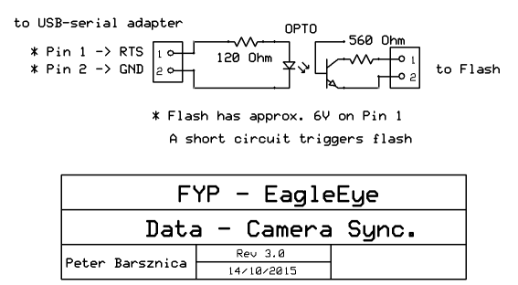
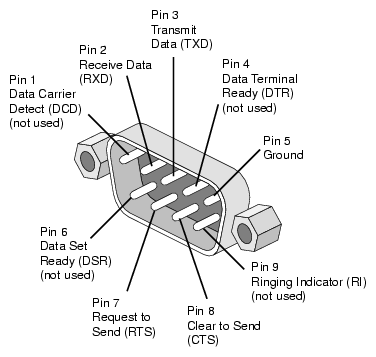

# Eagle Eye /// Capture Tool /// Documentation

## 1 Overview
This software records raw Vicon data into CSV files. The CSV files include 
timestamps and flash sync. The software is intended to be run on a system with 
the Vicon Tracker software installed. This may require administrative 
priviledges to install support libraries or driver software.

### 1.1 Authors
* Gwilyn Saunders
* Peter Barsznica

### 1.2 Legal
* Creative Commons 4.0 Attribution International
* http://creativecommons.org/licenses/by/4.0/legalcode

### 1.3 Prerequisites
* Windows 7+
* Python 2.7
* Vicon Tracker System (tested with v1.2)
* Serial RS232 Serial connection
* [Flash Sync circuit](3-1-flash-sync-circuit)
* A camera flash w/ PC-SYNC connection

## 2 Usage
### 2.1 Preparation
The Vicon system captures objects that are defined as unique "constellations"
of infared reflectors (approx 9mm diameter) placed on physical objects within 
the lab. These objects are configured in the *Vicon Tracker* software. Some 
experimental/working objects are stored in the [data/objects](data/objects) folder.

Ensure your running time is sufficient, modify via the command line option or
within the [config file](#3-3-configuration-file). 

Ensure the correct serial port is defined in the config file.
A list of available serial ports can be found with this command:
``` sh
$ python -m serial.tools.list_ports
```

### 2.2 Procedure
The camera must not be moved between the calibration and capture steps. Thankfully, 
the Ricoh Theta m15 can be remotely triggered via a smart phone or tablet running
Android or iOS.

The tool will capture all active objects in the *Vicon Tracker* software. Be sure to
only enable the objects for a given scenario.

1. Ensure all preparations steps are completed
2. Prepare the camera for recording
3. Run the software (either by GUI or command line)
4. After the first flash, start the camera recording
5. The flash will trigger again, now start perform the scenario
6. The last flash will signal the end of the dataset
7. Stop the camera recording
8. Check the output folder that the objects are all recorded

### 2.3 Usage

```sh
$ python vicon_capture.py {-output <folder> | -time <in minutes> | -config <file> | -training <file>}
```

## 3 Additional
#### 3.1 Flash Sync Circuit
This is a circuit by design of Peter Barsznica that triggers a camera flash when
signalled from a serial connection to the computer. This matches the flash data
fields in the CSV file in order to syncronise the video and data feeds.

__This is the circuit detail__



__The circuit connects to the serial GND and CTS pins__




#### 3.2 Synchronisation
When running the software, the flash will trigger 3 times. This is a uncorrectable
side-effect of the hardware, therefore the software will delay a number of frames
(as specified in the [config file](#3-3-configuration-file)) before the first flash 
is triggered. There are still only 2 flashes recorded into the CSV.

### 3.3 Configuration File
The configuration file (.cfg) specifies common settings that don't need to 
change during a recording session or within a lab. These are the variables it 
contains and the corresponding defaults.

| Setting           | Description                                               | Default        |
|-------------------|-----------------------------------------------------------|----------------|
| ip_address        | The address of the Vicon Tracker software                 | 192.168.10.1   |
| port              | The port of the tracker software                          | 801            |
| date_format       | Formatting with which to timestamp output files           | Y-%m-%d\_%H-%M |
| flash_delay       | How long (in frames) to wait before beginnning the set    | 180            |
| framerate         | How often the tracker is to be polled (per second)        | 44.955         |
| default_time      | How long to run the capture (in seconds)                  | 180            |
| default_output    | Where the data is stored                                  | data/raw       |
| output_delimiter  | The CSV delimiter                                         | ,              |
| serial_device     | The serial adapter port name                              | COM4           |
| run_serial        | Whether to activate the flash                             | True           |
| trainer_target    | Which target to look for when training                    | EEWand         |

### 3.4 Raw CSV Data Output
This is object data represented in the Vicon World Coordinates. Each file
contains data for a single object captured. Containing positional, rotational,
sychronisation and marker data.

| Column | Data        | Type  | Examples |
|--------|-------------|-------|----------|
| 0      | Timestamp   | float | 0.144    |
| 1      | Sync        | char  | F, .     |
| 2      | X-axis      | float | 5121.54  |
| 3      | Y-axis      | float | 1543.33  |
| 4      | Z-axis      | float | 45.1431  |
| 5      | X-rotate    | float | 0.1123   |
| 6      | Y-rotate    | float | 0.2323   |
| 7      | Z-rotate    | float | 2.1102   |
| 8      | Max Markers | int   | 5        |
| 9      | Visible     | int   | 4        |


__Synchronisation__

-   . (dot) - is a regular frame
-   F - is a flash frame, there should only be 2 of these within a dataset

__Rotation__

The rotational X, Y, Z is a
[Euler Vector](https://en.wikipedia.org/wiki/Axis%E2%80%93angle_representation),
not to be mistaken with Euler Angles - pitch, yaw, roll.


## 4 Re-compiling PyVicon
This software has been tested at the Mechatronic Lab in the Mawson Lakes 
University of South Australia campus. The lab runs Vicon Tracker (Rigid bodies) v1.2 32bit. 

__Visual Studio versions__

To recompile, the system needs to have Visual Studio installed. The python 
setuptools only read the `VS90COMNTOOLS` environment variable, some tweaking is 
required if that is not your VS version.

- No SET required (for VS2008)
- `SET VS90COMNTOOLS=%VS100COMNTOOLS%` (for VS2010)
- `SET VS90COMNTOOLS=%VS110COMNTOOLS%` (for VS2012)
- `SET VS90COMNTOOLS=%VS120COMNTOOLS%` (for VS2013)

__Vicon DataStream SDK__

Download the Vicon DataStream SDK from [here](http://www.vicon.com/products/software/datastream-sdk).
If this doesn't match your Vicon installation, find the right one with Google or
hope that your installation includes the SDK.
Copy all of the SDK files into the `python_vicon` folder.

__Compiling__

- open a terminal in the `python_vicon` directory
- run these: (supposedly they help?)

     ```sh
        SET MSSDK=1
        SET DISTUTILS_USE_SDK=1
    ```
- execute the setup.py `$ python setup.py build`
- check for errors in the output (good luck)
- open the new `build` folder, look for a `lib.win32` or `lib.win-amd64`
- copy the `pyvicon.pyd` back into the root `python_vicon` folder

