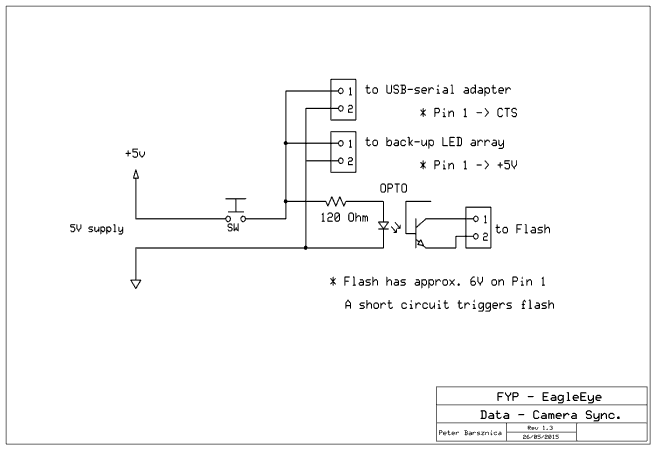

# Eagle Eye /// Capture Tool /// Documentation

## 1 Overview
This software records raw Vicon data into CSV files. The CSV files include 
timestamps and flash sync. The software is intended to be run on a system with 
the Vicon Tracker software installed. This may require administrative 
priviledges to install support libraries or driver software.

### 1.1 Authors
* Gwilyn Saunders
* Kin Kuen Kiu
* Manjung Kim
* Peter Barsznica

### 1.2 Legal
* The all-scientific CRAP License
* http://matt.might.net/articles/crapl/CRAPL-LICENSE.txt

### 1.3 Prerequisites
* Windows 7+
* Python 2.7
* Vicon Tracker System (tested with v1.2)
* Serial RS232 Serial connection
* [Flash Sync circuit](3-1-flash-sync-circuit)
* A camera flash w/ PC-SYNC connection

### 1.4 Inputs
* Input data delivered via Vicon

### 1.5 Outputs
The software outputs two file types.
* A raw [Vicon CSV](#3-3-raw-csv-data-output) data file from _run_capture.bat_
* An [Origin XML](#3-4-origin-xml-data-output) file from _run_calib.bat_

## 2 Procedure
The procedure is as follows:
* Create physical objects
* [Prepare](#2-1-preparation) the camera, sync, Vicon tracker
* [Configure](#2-1-2-configuration) software accordingly
* [Calibrate](#2-2-room-calibration) the room
* [Capture](#2-3-data-capture) data

### 2.1 Preparation
#### 2.1.1 Vicon objects
The Vicon system captures objects that are defined as unique "constellations" 
of dots placed on physical objects within the lab. These objects are configured 
in the _Vicon Tracker v1.2_ software. Some experimental/working objects are 
stored in the [objects](ojects) folder.

Each object is given a name in Vicon, this name must be specified each time 
this software is run. This is done in the batch executable files (.bat). Simply 
right click to edit, double click to execute.

#### 2.1.2 Configuration
Most of these setting don't need to change. Different settings may apply to 
different Vicon Systems. Typically only the _framerate_ or _serial_device_ 
variables would need tweaking. The configuration file must contain all of the 
variables as specified in this [documentation here](#3-2-configuration-file). 

A list of available serial ports can be found with this command:
```sh
$ python2 -m serial.tools.list_ports
```

#### 2.1.3 Syncronization
The video file and Vicon data need to be syncronized. This is done with a 
[sync circuit](#3-1-flash-sync-circuit). The circuit signals the software to create 
a marker in the data and simultaneously triggers a camera flash to be seen in 
the video.

_IMPORTANT:_ a dataset can only contain two flashes. These two flashes represent 
the start and end of a dataset. The [Format Tool](/eagleeye/formattertool) 
will ignore any data outside of these flashes.

### 2.2 Room Calibration
Before data can be captured, the camera pose must be recorded. This is done with 
the _run_calib.bat_ file and the _Vicon Wand_. 

1. Ensure the _Vicon Tracker_ software is running
2. Place the Wand in view of of the camera, close enough to distinguish the dots
3. Ensure the Wand is enabled in the tracker software
4. Execute (double click) the _run_calib.bat_ file
5. Check the _raw_data_ folder for the [orgin XML](#3-4-origin-xml-data-output) file.
6. Remove the Wand from the scene

### 2.3 Data Capture
The camera _must not_ be moved between the calibration and capture steps. 
Thankfully, the Ricoh Theta can be remotely triggered via a smartphone.

1. Ensure the appropriate objects are enabled in the tracker software
2. Edit the _run_capture.bat_ file to include all objects to be tracked
3. Also edit to specify the recording time
4. Prepare the camera for recording
5. Execute the _run_capture.bat_ file
6. Start the camera recording
7. Trigger the Flash-Sync - start of the dataset
8. Perform movements with the objects
9. Trigger the Flash-Sync again - end of the dataset
10. Stop the camera recording
11. Wait or force close the batch file
12. Check the _raw_data_ folder, that the objects are all recorded

## 3 Additional
### 3.1 Flash Sync Circuit
This is a circuit by design of Peter Barsznica that triggers a camera flash and 
an identifier in the software, in order to syncronise the video and data feeds.

This is the circuit detail:



The circuit connects to the serial GND and CTS pins:


### 3.2 Configuration File
The configuration file (.cfg) specifies common settings that don't need to 
change during a recording session or within a lab. These are the variables it 
contains and the corresponding defaults.

| Setting          | Default       |
| ---------------- | ------------- |
| ip_address       | 127.0.0.1     |
| port             | 802           |
| date_format      | Y-%m-%d_%H-%M |
| framerate        | 30            |
| output_folder    | data          |
| output_delimiter | ,             |
| serial_device    | COM4          |
| run_serial       | True          |

### 3.3 Raw CSV Data Output
This is object data represented in the 
[World Coordinate System](/eagleeye/converttool#3-2-world-coordinates). Each 
file contains positional and rotational data for an individual object captured 
by the Vicon Tracker. 

| Column | Data      | Type  | Examples |
| ------ | --------- | ----- | -------- |
| 0      | Timestamp | float | 0.144    |
| 1      | Sync      | char  | F, L, .  |
| 2      | X-axis    | float | 5121.54  |
| 3      | Y-axis    | float | 1543.33  |
| 4      | Z-axis    | float | 45.1431  |
| 5      | X-rotate  | float | 0.1123   |
| 6      | Y-rotate  | float | 0.2323   |
| 7      | Z-rotate  | float | 2.1102   |

#### 3.3.1 Sync
* . (dot) - is a regular frame
* F - is a flash frame, they may be sequential but must only appear twice within a dataset
* L - is a late frame, this means the data was not recieved before the next frame was due

#### 3.3.2 Notes
* The timestamp is 0 (zero) on the first frame
* The X, Y, Z rotational data corresponds to pitch, yaw, roll (which is which is unknown)

### 3.4 Origin XML Data Output
```xml
<?xml version="1.0"?>
<ViconCalib>
  <timestamp at="1.4960000515"/>
  <roomOrigin
      x="6877.87615416716"
      y="895.554984200831"
      z="64.0212346077015"
      rx="-0.00035405915893805"
      ry="0.0813275486771378"
      rz="-0.528133124177889"
  />
</ViconCalib>
```

This XML data must be kept with the CSV data, it specifies where the 
[common world coordinate origin](/eagleeye/converttool#3-2-1-common-world-coordinate-origin) 
lies. This is necessary to convert Vicon world coordinates to the common world 
coordinates.
